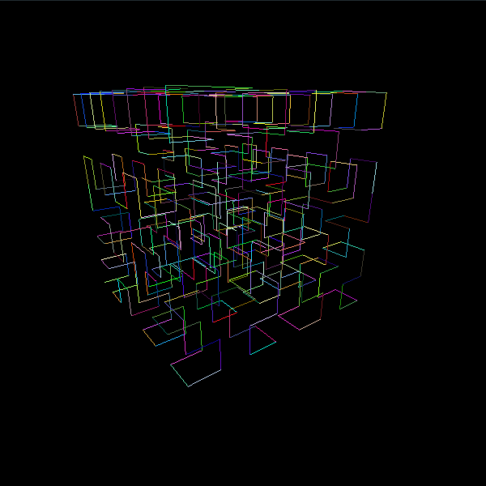

# L-system

This project is all about generating a L-system. It also creates a .obj file of the generated model.

## Usage

To compile the project
```
$ make
```

To execute
```
$ ./lsystem <configuration_file>
```

## Screenshot

This is an example of 3D Hilbert Curve using the L-system, with
```
$ ./lsystem resources/hilbert.txt


